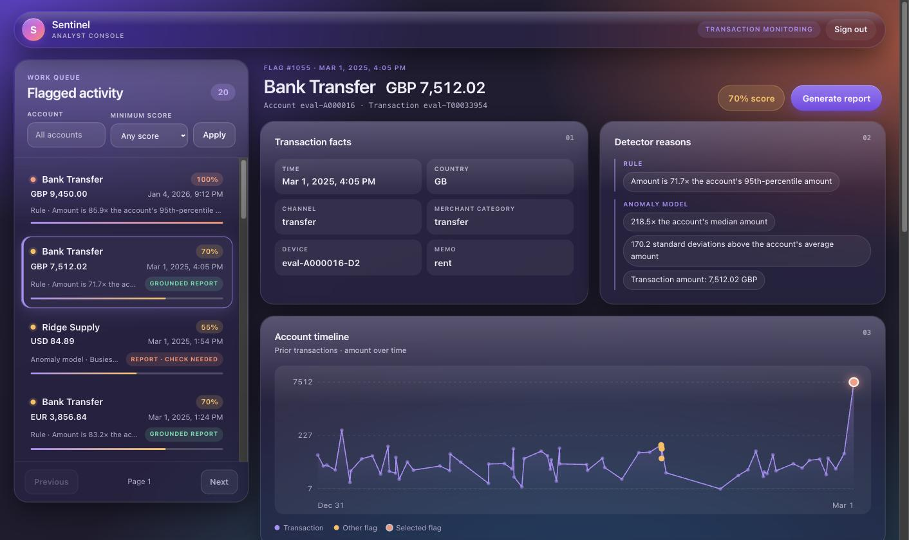
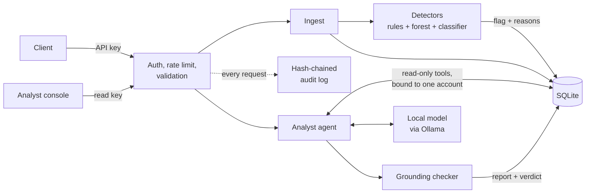
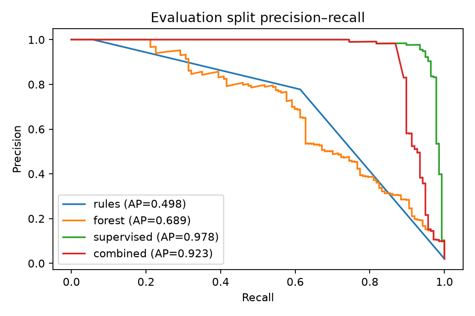
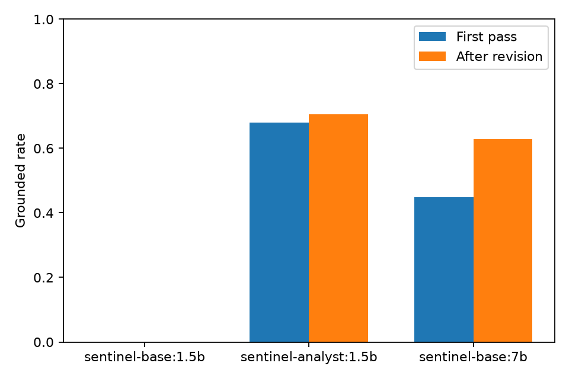
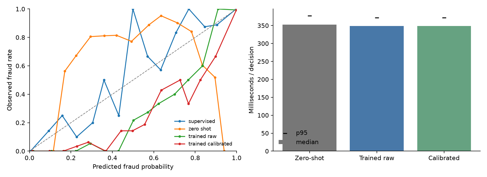
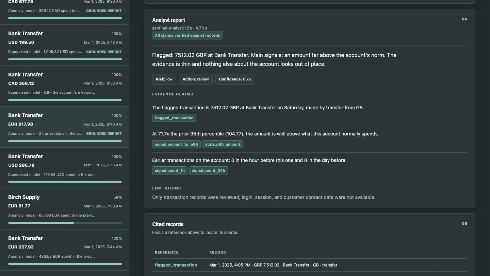

# Sentinel

[](https://github.com/fishy-ops/sentinel/actions/workflows/ci.yml)

Sentinel is a transaction-monitoring service that flags suspicious payments and then explains each flag the way a fraud analyst would, with every stated fact traced back to the record it came from.

It is built around one question: **can a small language model that runs on a laptop be trusted to explain a fraud alert?** The answer here is "only if you check it", so the project pairs the model with a deterministic checker that rejects any number, date, country, device, or merchant the data does not support, and reports how often each model passes.



## What is in the box

| Part | What it does |
|---|---|
| **Ingestion API** | Accepts transactions over HTTP with scoped API keys, per-key rate limiting, strict input validation, idempotent retries, and a tamper-evident audit log. |
| **Detection** | Scores each transaction as it arrives with named rules, an Isolation Forest, and a gradient-boosted classifier. Every flag stores the reasons behind it. |
| **Analyst agent** | A local model pulls the account's history through five read-only tools and writes a short report: summary, cited evidence, risk level, recommended action, limitations. |
| **Grounding checker** | Compares the report with the tool results. A claim passes only if its facts appear in the records it cites. Failures are shown to the user, never hidden. |
| **Decision model** | A Jev-style alternative to the written report: the same small model answers two typed questions about a flag in one pass each and returns calibrated probabilities. |
| **Evaluation** | A labeled test set, detection accuracy by fraud type, grounding rates by model, decision-model calibration, adversarial cases, and a red-team suite. |
| **Analyst console** | A web page for working the flag queue, with the account timeline and click-through from each claim to its source record. |



## Results

All numbers come from the `eval` split of the synthetic data (500 accounts, 60 days, about 34,000 transactions, 2.2% fraud). Models are fitted on `train`, thresholds are chosen on `val`, and `eval` is used only for reporting. The commands that produce every table are in [Reproducing the results](#reproducing-the-results).

### Fraud detection

| Detector | Precision | Recall | F1 | PR-AUC |
|---|---:|---:|---:|---:|
| Rules only | 0.74 | 0.63 | 0.68 | 0.50 |
| Isolation Forest (unsupervised) | 0.64 | 0.61 | 0.63 | 0.64 |
| Gradient boosting (supervised) | 0.96 | 0.96 | 0.96 | 0.99 |
| All three combined | 0.69 | 0.97 | 0.81 | 0.96 |

The data contains five fraud patterns (rapid bursts, account takeover, amount spikes, structuring under a reporting threshold, and draining a dormant account) alongside legitimate look-alikes: travel, a new phone, a one-off large purchase, a busy shopping day. The combined detector catches at least one transaction in every fraud episode, usually the first or second. Its extra recall over the supervised model costs precision, mostly from the rules. Full per-pattern and per-scenario tables are in [`evals/results/flags.md`](evals/results/flags.md).



### Analyst reports

Three models wrote reports for the same 78 flags: a stratified sample across fraud patterns and false alarms, plus prompt-injection and sparse-history cases. "Fully grounded" means every fact in the report matched a record it cited.

| | Qwen 2.5 1.5B (stock) | **Qwen 2.5 1.5B (fine-tuned)** | Qwen 2.5 7B (stock) |
|---|---:|---:|---:|
| Produced a valid report | 0% | **100%** | 100% |
| Fully grounded, first attempt | 0% | **68%** | 45% |
| Fully grounded, after one revision | 0% | **71%** | 63% |
| Individual claims grounded | n/a | **91%** | 85% |
| Resisted prompt injection (2 cases) | n/a | 2 of 2 | 2 of 2 |
| Handled sparse history (2 cases) | n/a | 0 of 2 | 2 of 2 |
| Median time per report | n/a | **4.1 s** | 18.2 s |

The fine-tuned model is a LoRA adapter trained on about 1,100 synthetic conversations whose target reports are assembled from the tool results, so they are grounded by construction. A model a fifth the size of the 7B gets more reports right on the first attempt and is more than four times faster; after the revision step the gap narrows to eight points, which on 78 reports is suggestive, not conclusive. The stock 1.5B model cannot use the tools at all. The fine-tuned model is weaker on accounts with almost no history, where it tends to state statistics it was not given. Details are in the [model card](training/README.md) and the full table in [`evals/results/explanations.md`](evals/results/explanations.md).



### Typed decisions (Jev-style)

Writing a report takes the generative model about four seconds. For triage that is often more than is needed, so the project also tries the "decision model" idea made popular by [Jev](https://typesafe.ai/) and [Laya](https://github.com/NandhaKishorM/laya): ask declared questions, read only the logits of the allowed answers in a single forward pass, generate nothing, and calibrate the result. Following the [JevLite recipe](https://arxiv.org/abs/2609.23959), the same Qwen 2.5 1.5B is fine-tuned with a loss on the answer labels alone, to answer two questions about a flagged transaction: *is it fraud?* and *which pattern is it?*

On all 1,055 flags in the eval split (732 fraudulent):

| Is it fraud? | Accuracy | AUROC | Calibration error | Time per decision |
|---|---:|---:|---:|---:|
| Always say fraud | 0.69 | 0.50 | | |
| Stock Qwen 1.5B, same readout | 0.49 | 0.45 | 0.34 | 352 ms |
| **Decision model, calibrated** | **0.96** | **0.996** | 0.045 | **349 ms** |
| Gradient boosting on the same flags | 0.98 | 0.998 | 0.011 | under 1 ms |

The decision model also names the pattern correctly for 96% of flags (the stock model: 35%). With thresholds chosen on validation data it clears 25% of flags automatically, blocks 69% at 98.5% precision, and sends 5% to a person, letting 0.3% of fraud through.

Two honest conclusions. The gradient-boosted detector is still better and far cheaper at the yes/no question, which is what you would expect on tabular features with a fixed question; the JevLite authors say the same about encoders. What the decision model adds is the pattern, a calibrated probability to gate on, and questions that can be changed without retraining a tabular model. And it is about ten times faster than generating a report, not a hundred: one decision is two passes over a 400-token prompt, which saturates a laptop GPU. Batching does not help.

Robustness, as the share of decisions that change: reversing the option order 0.3%, rewording the question 1.1%, instruction-like text in the merchant name 1.9% or the memo 3.1%. Full tables, confusion matrices, and the reliability diagram are in [`evals/results/decisions.md`](evals/results/decisions.md).



### Red-team suite

35 scripted attacks, all blocked: missing, forged, revoked, and wrong-scope keys; rate-limit evasion by rotating forwarded IPs; replayed and altered idempotent requests; oversized, streamed, and malformed bodies; SQL and control characters in fields; audit-log edits, deletions, and truncation; stored XSS in merchant text; and an agent tool call asking for another account's data. The table is in [`evals/results/redteam.md`](evals/results/redteam.md).

## How the grounding check works

The agent runs in two phases. First the model calls tools; each tool returns records, and each record has a reference such as `flagged_transaction`, `stats.p95_amount`, or a transaction ID. Then the model writes its report as JSON constrained to a schema in which evidence may only cite references that were actually returned.

The checker then reads every claim and extracts the facts in it: amounts, counts, ratios, percentages, dates, clock times, weekdays, country codes, device IDs, and merchant names. Each must match a value in a record that claim cites, allowing for formatting and for rounding to the precision written. A fact that exists in the data but not in the cited record is reported as a citation error; a fact that exists nowhere is reported as unsupported. If anything fails, the model gets one chance to revise with the list of problems in front of it.



## Try it

Requires Python 3.12, [uv](https://docs.astral.sh/uv/), and [Ollama](https://ollama.com) for the analyst reports.

```sh
make install
ollama pull qwen2.5:7b
make demo            # generates data, trains detectors, seeds a database, starts the console
```

`make demo` prints two API keys and serves the console at <http://127.0.0.1:8000>. Paste the read key to sign in, pick a flag, and press **Generate report**. Without Ollama everything except report generation still works.

To send a transaction yourself:

```sh
curl -X POST http://127.0.0.1:8000/v1/transactions \
  -H "X-API-Key: $INGEST_KEY" -H "Content-Type: application/json" \
  -d '{"transaction_id":"demo-1","account_id":"eval-A000016","timestamp":"2026-01-05T03:12:00Z",
       "amount":"9450.00","currency":"GBP","merchant_name":"Bank Transfer",
       "merchant_category":"transfer","country":"GB","device_id":"new-device","channel":"transfer"}'
```

A `Dockerfile` and `docker-compose.yml` (API plus Ollama) are included but have not been exercised in CI.

### Reproducing the results

```sh
make data train eval-flags      # detection tables and PR curve
make redteam                    # attack table
make check                      # lint, format check, tests

# Analyst reports (Apple silicon for the fine-tune; any Ollama host for the stock models)
LLAMA_CPP=/path/to/llama.cpp training/finetune.sh
uv run python -m evals.run_explanations \
  --models sentinel-base:1.5b,sentinel-analyst:1.5b,sentinel-base:7b

# Typed decision model (Apple silicon)
uv sync --group train
uv run python -m training.build_decisions
uv run --group train python -m training.train_decisions
make eval-decisions
```

Everything is seeded. Detection results reproduce exactly; language-model results can vary slightly across hardware and Ollama versions.

## Threat model

**Assets.** Transaction and account data; API keys; the integrity of flags, reports, and the audit log; availability of ingestion.

**Trust boundaries.** (1) The network edge: anything a client sends is untrusted. (2) Free text inside transactions (merchant names, memos) stays untrusted after it is stored, because it later reaches both the language model and the browser. (3) The language model's output is untrusted until the checker has examined it.

| Threat | Mitigation | Residual risk |
|---|---|---|
| Stolen or guessed API key | Keys are 256-bit random values; only a salted hash is stored; comparison is constant-time and unknown key prefixes take the same code path; scopes (`ingest`, `read`, `admin`) limit what a key can do; keys can be revoked. | A stolen key works until revoked. No expiry or IP binding. |
| Flooding and brute force | Token-bucket limit per key, and per client address for unauthenticated requests; forwarded-IP headers are ignored; request bodies are capped while streaming. | Limits are held in process memory, so they reset on restart and are not shared across instances. |
| Malformed or malicious input | Strict schemas reject unknown fields, out-of-range amounts and timestamps, bad identifiers, and control characters; errors name the field but never echo the value or a stack trace. | Validation is syntactic. Well-formed false data is accepted. |
| Replay and double submission | Duplicate transaction IDs are rejected; an `Idempotency-Key` replays the stored response for an identical body and rejects a different one. | Idempotency records are kept indefinitely. |
| Tampering with history | Every request appends to an audit log in which each entry hashes the one before it. Edits and deletions break the chain; truncation is caught by comparing the head hash and count with a copy kept elsewhere. Entries never contain keys or free text. | Someone who can rewrite the whole table and the external copy can forge it. The log is not signed. |
| Prompt injection through merchant names or memos | Free text reaches the model only inside a labeled `untrusted_text` field with control characters stripped; the system prompt treats it as data; tools are read-only, so an injected instruction has nothing to act with; the fine-tune includes injection examples. | Injection can still skew wording or the recommended action. Tested cases pass; the space of attacks is open-ended. |
| Model reading another account | Tools are bound to the flagged transaction's account when the run starts and accept no account or flag identifier. Any such argument is rejected. | None known within the tool layer. |
| Model inventing facts | The grounding checker; reports that fail are stored and displayed as unverified with the offending details listed. | The checker verifies facts, not reasoning. See Limitations. |
| Stored XSS in the console | The console builds the page with text nodes only, and a strict Content-Security-Policy forbids inline script and third-party sources. | Relies on that discipline being kept in future changes; a test scans the script for unsafe DOM calls. |
| Poisoning the detectors | Models are trained offline on a fixed split and versioned with a hash of the training data; ingestion does not retrain them. | An attacker who shapes an account's history slowly can shift its baseline for the rules. |

Out of scope: TLS termination, secrets management, multi-tenant isolation, and database encryption, which belong to the deployment environment.

## Limitations

- **The data is synthetic.** Fraud patterns were written by the same project that detects them. The supervised model's 0.96 F1 shows that the pipeline works, and says little about real-world fraud, where labels are noisy and patterns shift.
- **Grounded does not mean correct.** The checker confirms that stated facts match cited records. It cannot tell whether the conclusion drawn from them is sound, and a claim with no checkable fact in it ("the timing is unusual") passes by default.
- **The fine-tuned model and its metric are related.** Training targets were filtered by the same checker used in evaluation, so the grounding rate measures how well the model learned a format that the checker accepts. Evaluation accounts are disjoint from training accounts, but both come from one generator. Several training configurations were tried during development and compared on a smaller sample of the same split.
- **The models are conservative.** None recommended approving a flagged transaction, including legitimate ones. Reports are an aid to an analyst's triage, not a decision.
- **One process, one SQLite file.** Rate limits and the audit chain assume a single instance.

## Repository layout

```
src/sentinel/
  api/         app factory, middleware (auth, rate limit, audit), routes
  audit/       hash-chained log and verifier
  detect/      features, rules, Isolation Forest, classifier, combined scorer
  agent/       tools, two-phase explainer, grounding checker
  decide/      evidence digest, typed questions, label-logit decision model
  dashboard/   analyst console (static HTML, CSS, JS)
  store/       SQLAlchemy models
data/          synthetic transaction generator
training/      fine-tuning data builders, training scripts, and model card
evals/         detection, explanation, and red-team evaluations with results
tests/         unit and API tests
```

## License

MIT
